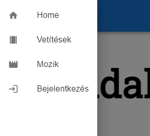

# WebTech-2 Beadandó dokumentáció

## Feltelepítés és elindítás
### 1. lépés
Mindkét mappában a backend és a frontend mappán belül adjuk a ki az alábbi parancsot:

```npm install```

### 2. lépés
Mindkét mappán belül indítunk egy terminált és kiadjuk az alábbi paranocst:
    
```npm start```

A parancs kiadása után elindul a **React webszerver** és majd a **http://Localhost:3000** porton lehet majd megnyitni, és a **backend** pedig majd az **5000-es** porton fog elindulni.


A regisztráció és a bejelentkezést követően több lehetősgünk van az oldalon csinálni.
Kijelentkezve csak adatok lekérése lehetsgés csak annak módosítása és létrehozása csak bejelentkezve lehetséges.

## Felhasználói felület
Amíg nem vagyunk be jelentkezve a fiókunkban az oldalon korlátozott lehetőségeink vannak ebben az esetben olyan oldalak elérhetőek a számunkra ahol csak GET kérésekkel dolgozunk szóval valamilyen lekérdezésről van szó de adat manipulációrol vagy felülírásról szó nincs. Amik első körben mindig elérhetőek számunkra az alábbi ábra mutatja.(1. ábra)
<div style="text-align: center;">
     
</div>

A bejelentkezés fülre kattintva lehetőségünk van Fiókot létre hozni vagy esetleg bejelentkezni az oldalra.
<div style="display: flex;">
  <div style="flex: 50%; padding: 5px;">
    
    (2. ábra) Bejelentkezés
  </div>
  <div style="flex: 50%; padding: 5px;">
    
    (3. ábra) Regisztráció
  </div>
</div>

Bejelentkezés után már sokkal több lehetőségünk van az oldalon ezt a következő ábra is jól szemlélteti.
<div style="text-align: center;">
     
     (4. ábra)
</div>
Itt megjeleník fiók kezelési Opció illetve Filmek felvétele egy listára vagy azok módosítása is. Elöszőr nézzük meg hogyan is nézki a fiók kezeléssel kapcsolatos oldal.
<div style="text-align: center;">
     
     (5. ábra)
</div>
A következő oldalon felvehetünk filemeket a vetítési listára illetve módosíthatjuk vagy törölhetjük őket a listából is ezt a követekező ábrán lesz látható.
<div style="text-align: center;">
     
     (6. ábra)
</div>
A következő képen azt láthatjuk hogyan is látszik hogyan tudjuk módsítani az adatokat a fenti listából kiválastjuk az egyik filmet és annak az adatait beilleszti a megfelelő helyekre.
<div style="text-align: center;">
     
     (7. ábra)
</div>

Amiket felvettünk a listára filmeket összesítve egy táblázatban tudjuk megnézni és milyen adatokat tartalmaz.
<div style="text-align: center;">
     
     (7. ábra)
</div>

A végére maradt az az oldal ahol megnézhetjük mely városokban mennyi mozi található hol melyik városban utca ház számmal nyitva tartással együtt.
<div style="text-align: center;">
     
     (8. ábra)
</div>

## Kód kapcsolatos dokumentáció
### Frontend Kód leírás
Az oldalok modulárisan épülnek különböző komponensek által, és ha valami változik az oldalon elég csak azt az egy komponenst renderelni és nem kell az egész oldalt ha csak 1 érték változik meg például az oldalon. Context-ekben tárolom az értékeket az felhasználórol illetve különböző alerteknek ad helyet. Az alert box-om nem más mint egy snackbar ami Bejlenetkzeés vagy valami adat frissítés során vagy törléskor fog megjelenni ha sikeres volt hanem és egy üzenet fog meg jelenni benne.
<div style="text-align: center;">
     
     (9. ábra) Alerts
</div>

ilyen allertek jelennek meg a sncakbar-ban ami 5 sec után eltűnik a képernyőröl.
``` 
<Snackbar 
            open={isOpen} 
            autoHideDuration={5000} 
            onClose={handleClose} 
            anchorOrigin={{
                vertical:'top',
                horizontal:'center'
            }}>
            <Alert severity={severity}>{msg}</Alert>
        </Snackbar>
```
Ebben az implementációban látható hogyan is hoztam létre a fentebb említet snackbar-okat.
Ez az alert külön komponensként van tárolva és csak property-ken keresztül kerül beállításra az egyes mezők.

Ahogy minden input field is kivan szedve külön komponensként mert többször kerül felhasználásra, illetve ha meg változik valami érték benne elég azt az egy komponenst változtatni és nem kell újra renderelni az egész oldalt ahogy már említettük.
```
const Input = ({label, ...otherProps}) =>{
    return(
    <div className='Input-container'>
       <input 
            className='Input-box'
            {...otherProps}
        />
        {label && (
        <label
          className={`${
            otherProps.value.length ? 'shrink' : ''
          } Input-box-label`}
        >
          {label}
        </label>
      )}
    </div>
)};
```
Ahogy a kódban látható ha a otherProps.value.length 0 akkor a label szövegével nem csinálunk semmit marad a helyén, de ha a **Length** értéke nagyobb mint **nulla** **(otherProps.value.length > 0)** akkor a label szövegünk kap egy **shrink** classname értéket amit a styles.scss fileba meghatároztunk a fentebb említett kódba nem látszik mert annyira nem fontos most a számunkra.


Ezek a kódok voltak amelyek érdekesek voltak számunkra mert a többi oldalt felhasználásra kerülnek a gombok lennének még érdekesek a számunkra de hasonlít a megoládsa a fentebb említett input mezőkre.

### Backend Kód leírás